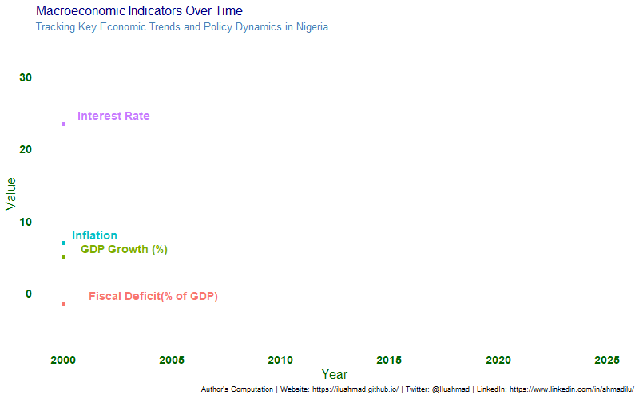
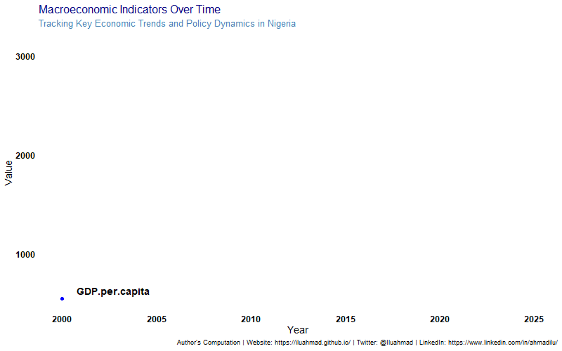
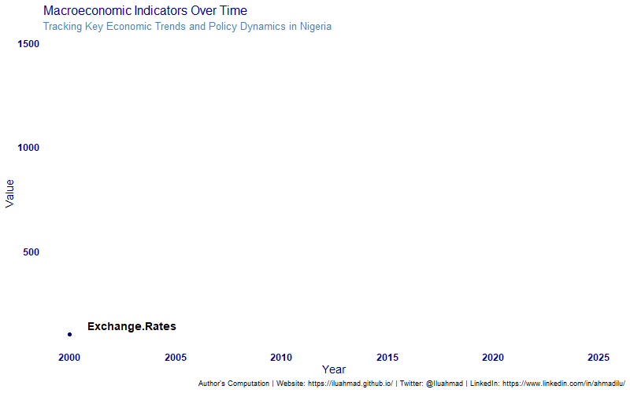
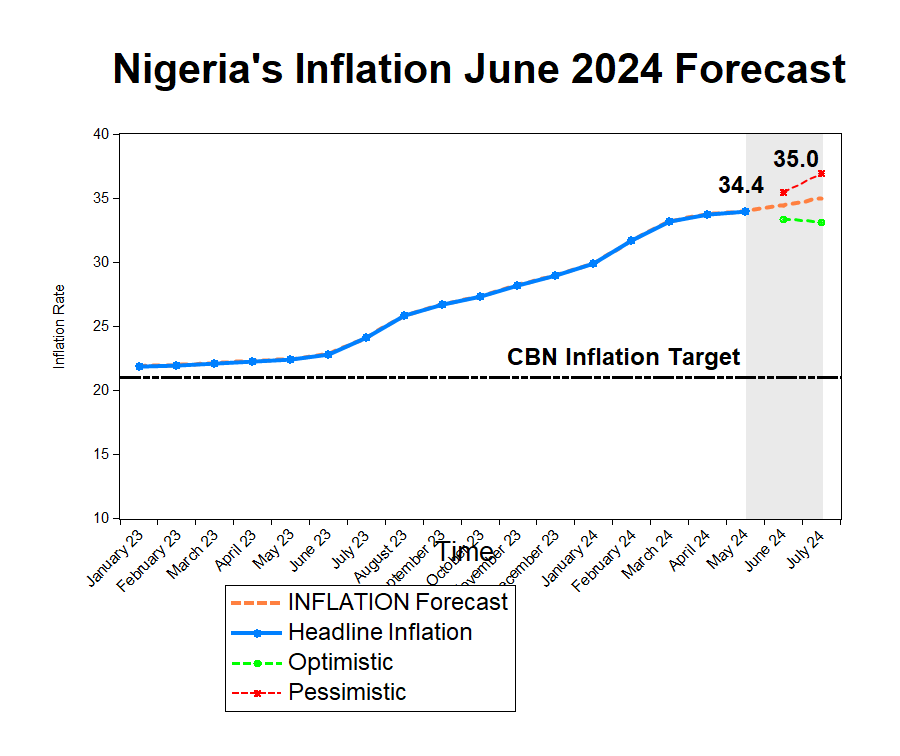

[Download Energy Model Codes](Energy%20Model.R)

[Download Inflation Workfile](inflation%20flash%20note.wf1)

[Download Energy Subsidy Model](Energy%20Subsidy.tex)

[Download Sample Nigerian Macro Model](NG_model.mod)

[Download Bayesian VAR Model](Bayesian%20VAR%20Model.r)

[Charts](Charts)

# **Macro Indicators**

{width="635"}

